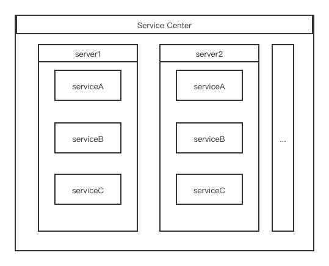

### GRPC Service Center

**Service Center structures**



**GRPC Pool Options**
```go
//GrpcPool Config
type Options struct {
	Cap 		int
	Targets 	[]string
	ClientKeepAlive	bool
	DialTimeout 	time.Duration
	IdleTimeout 	time.Duration
	PingTimeout 	time.Duration
	ForcePermit 	bool
}
```

**Custom GRPC Client Builder**
```go
//IDemoClient is defined in demo.pb.go
type IDemoClient interface {
	Read()
	Write()
}
// DemoClient is a struct of IDemoClient
type DemoClient struct {
    conn grpc.ClientConnInterface
}
func (tb *DemoClient) Read () {}
func (tb *DemoClient) Write () {}
//DemoClientBuider warp grpc.ClientConnInterface and return client in a interface type
func DemoClientBuider(conn grpc.ClientConnInterface) interface{} {
    return &DemoClient{conn}
}

```

**Create Service Center**
```go
//Make a GrpcPool Option
opt,_ := NewOptions(10,[]string{"127.0.0.1:9999"})
//Set options of grpc client
gprcOptions := []grpc.DialOption{grpc.WithInsecure()}
//Create Server of Conn
sc,_ := NewServerCluster("server1",*opt,grpcOptions)
// register functions of creating gprc service client
builders := make(map[string]serverBuilderFunc)
builders["demoService"] = DemoClientBuider

sc.SetClientBuilders(builders)
//Create Service Center
sCenter := &ServiceCenter{}
//register cluster into center
sCenter.Register(sc)
```

**Do RPC Call**
```go
//get Server Cluster 
cluster, _ := sCenter.Get("server1")
//cluster := sCenter.UnsafeGet("server1")

GrpcConn ,err := cluster.GetClient()
conn,err := GrpcConn.Conn()

//Get Service Client
client,release,err := cluster.GetServerClient("demoService")
if err ！= nil {  
   return
}
defer release()
client.(DemoClient).Read()
```

> **get more in _test.go**